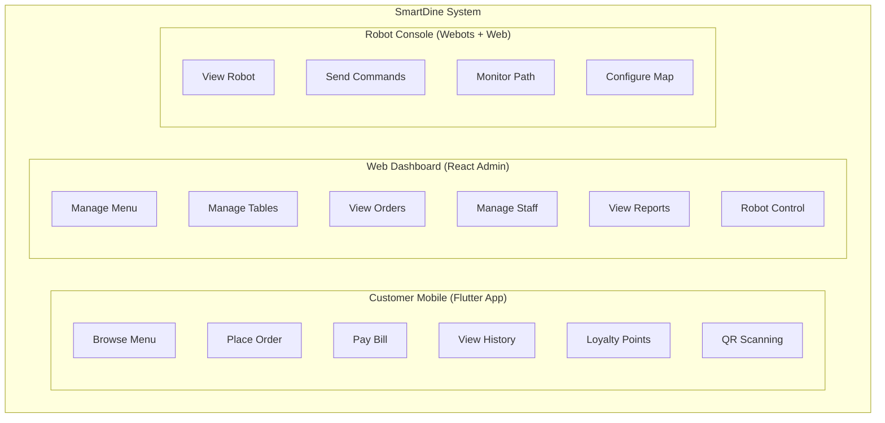
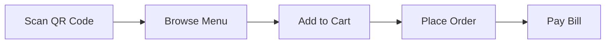
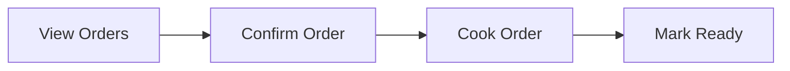
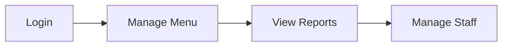
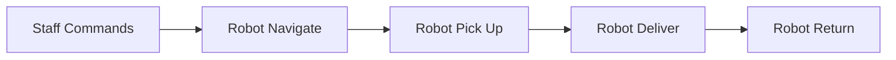

# Mermaid Diagrams for SmartDine (draw.io Compatible)

## 18. SmartDine System Overview (Section VI - User Manual §3.1)

---

## 19. Workflow Diagram - Customer Order Flow (Section VI §3.2)

---

## 20. Workflow Diagram - Kitchen Processing Flow (Section VI §3.3)

---

## 21. Workflow Diagram - Manager Management Flow (Section VI §3.4)

---

## 22. Workflow Diagram - Robot Delivery Flow (Section VI §3.5)

