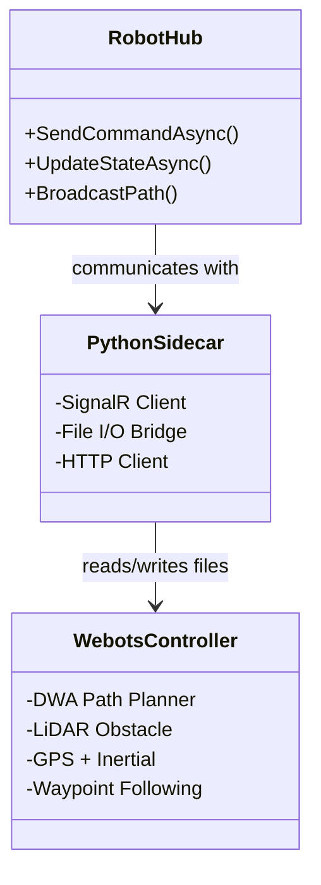
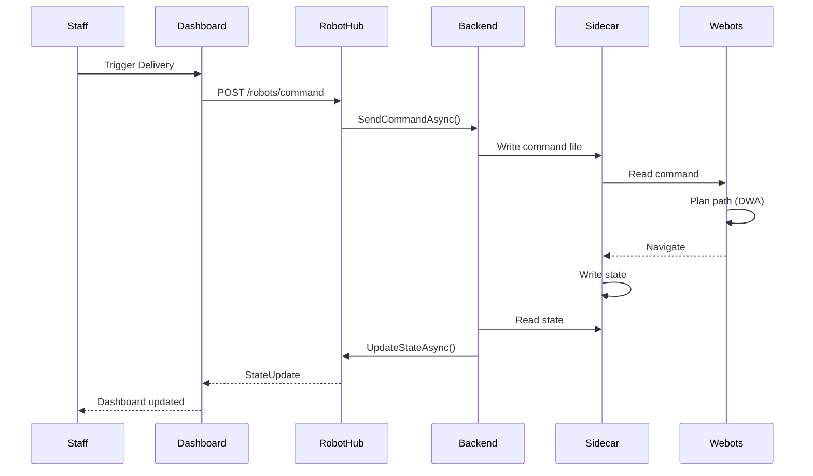
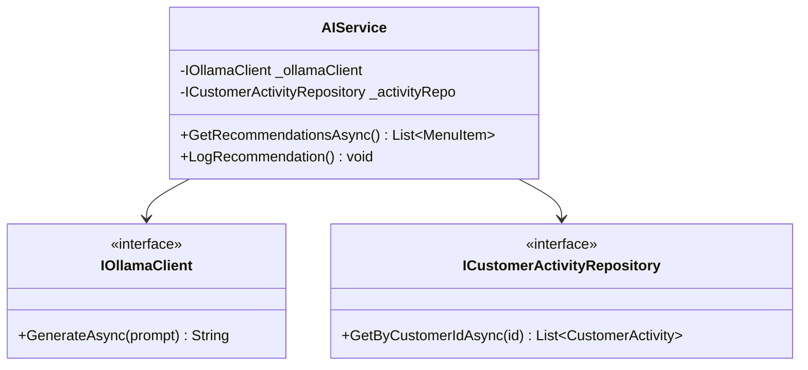
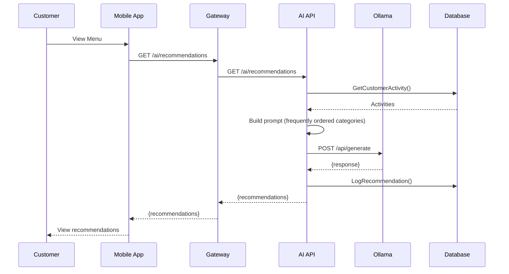
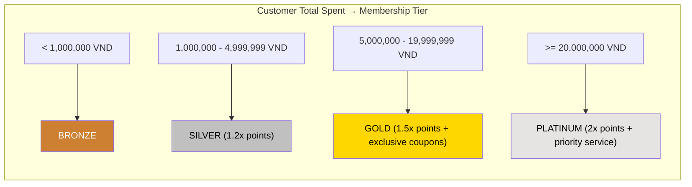

# Mermaid Diagrams - Robot, AI & Loyalty Modules (draw.io Compatible)

## 13. Class Diagram - Robot Module (§3.5.1)

---

## 14. Sequence Diagram - Robot Delivery (§3.5.2)

---

## 15. Class Diagram - AI Module (§3.6.1)

---

## 16. Sequence Diagram - Get Recommendations (§3.6.2)

---

## 17. Membership Tier Logic Diagram (§3.7.1)

